# Cloud Driver

A modern, cloud-native file management and infrastructure monitoring dashboard built with **Next.js**, **React**, and **AWS**. Cloud Driver provides seamless integration with AWS S3 for file storage, real-time dashboard analytics, and comprehensive cloud infrastructure management.

---

## 🎯 Overview

Cloud Driver is an enterprise-grade cloud management platform that enables teams to efficiently manage their AWS cloud infrastructure, monitor resources in real-time, and handle file storage operations through an intuitive web interface.

### Key Features

- 📊 **Real-time Dashboard** - Monitor cloud infrastructure and system metrics
- 📁 **S3 File Management** - Upload, download, and manage files in AWS S3 buckets
- 🏗️ **Infrastructure Visualization** - View and manage AWS resources (EC2, VPC, Security Groups, etc.)
- 🔍 **Advanced Monitoring** - Grafana integration for performance tracking and analytics
- 🚀 **CI/CD Integration** - Jenkins pipeline automation and deployment tracking
- 🔐 **IAM Management** - User and permission management through AWS IAM

---

## 🏛️ Architecture

Cloud Driver follows a modern cloud-native architecture pattern:

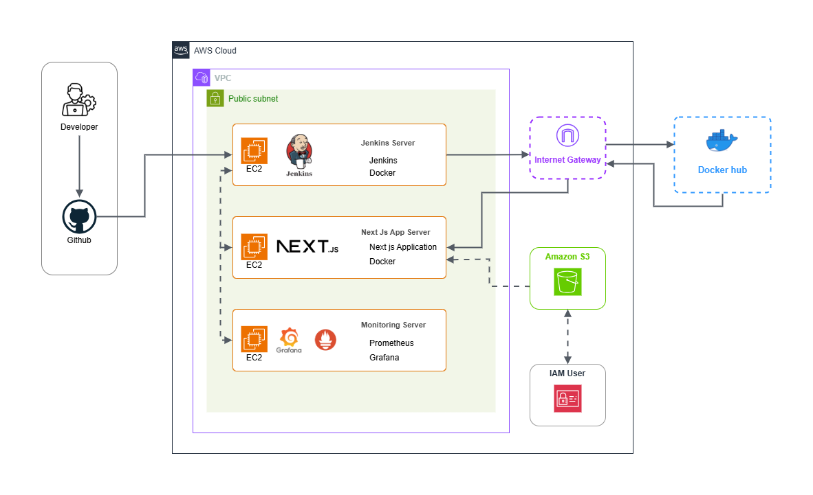

The system consists of:

- **Frontend**: Next.js 16+ with React 19 and Tailwind CSS for responsive UI
- **Backend API**: Next.js API routes with TypeScript for type safety
- **Cloud Services**: AWS S3 for storage, EC2 for compute, VPC for networking
- **Monitoring**: Grafana dashboards and Jenkins CI/CD pipelines
- **Infrastructure**: Load balancing, auto-scaling, security groups, and network management

---

## 📋 Prerequisites

Before getting started, ensure you have:

- **Node.js**: v18.0.0 or higher
- **npm** or **yarn**: Latest version
- **AWS Account** with appropriate permissions
- **AWS Credentials** (Access Key ID and Secret Access Key)
- **Environment variables** properly configured

---

## ⚙️ Installation & Setup

### 1. Clone the Repository

```bash
git clone <repository-url>
cd cloud-driver
```

### 2. Install Dependencies

```bash
npm install
# or
yarn install
```

### 3. Configure Environment Variables

Create a `.env.local` file in the project root:

```env
# AWS Configuration
AWS_REGION=us-east-1
AWS_ACCESS_KEY_ID=your_access_key_id
AWS_SECRET_ACCESS_KEY=your_secret_access_key
AWS_S3_BUCKET_NAME=your_s3_bucket_name

# Application
NEXT_PUBLIC_API_URL=http://localhost:3000
```

### 4. Build the Project

```bash
npm run build
# or
yarn build
```

---

## 🚀 Running the Application

### Development Mode

```bash
npm run dev
# or
yarn dev
```

The application will start at `http://localhost:3000`

### Production Mode

```bash
npm start
# or
yarn start
```

---

## 📦 Project Structure

```
cloud-driver/
├── src/
│   ├── app/
│   │   ├── api/
│   │   │   └── storage/
│   │   │       └── route.ts          # S3 API endpoints
│   │   ├── manage/
│   │   │   └── page.tsx              # Management page
│   │   ├── layout.tsx                # Root layout
│   │   ├── page.tsx                  # Dashboard home
│   │   └── globals.css               # Global styles
│   ├── components/
│   │   └── Sidebar.tsx               # Navigation sidebar
│   └── lib/
│       └── s3.ts                     # AWS S3 client configuration
├── public/                           # Static assets
├── readmefiles/                      # Documentation assets
├── package.json                      # Dependencies
├── tsconfig.json                     # TypeScript configuration
├── next.config.ts                    # Next.js configuration
└── tailwind.config.js                # Tailwind CSS configuration
```

---

## 🔌 API Endpoints

### Storage Management (`/api/storage`)

#### GET - List Files
```bash
curl http://localhost:3000/api/storage
```

**Response:**
```json
{
  "success": true,
  "data": [
    {
      "key": "file-name.pdf",
      "size": 1024000,
      "lastModified": "2024-01-15T10:30:00Z",
      "url": "https://bucket.s3.region.amazonaws.com/file-name.pdf"
    }
  ]
}
```

#### POST - Upload File
```bash
curl -X POST \
  -F "file=@/path/to/file.pdf" \
  http://localhost:3000/api/storage
```

#### DELETE - Remove File
```bash
curl -X DELETE \
  -H "Content-Type: application/json" \
  -d '{"key":"file-name.pdf"}' \
  http://localhost:3000/api/storage
```

---

## 📊 Dashboard Screenshots

### Dashboard Overview
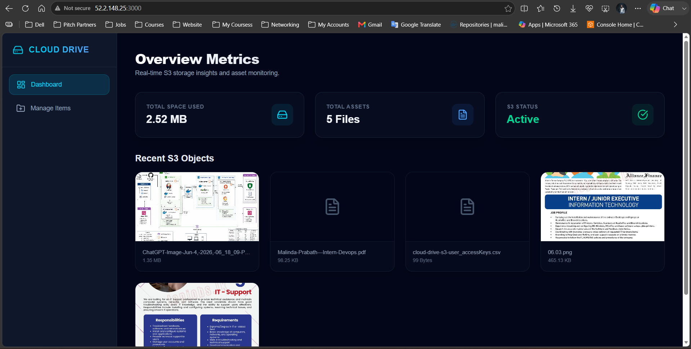

### Dashboard Details
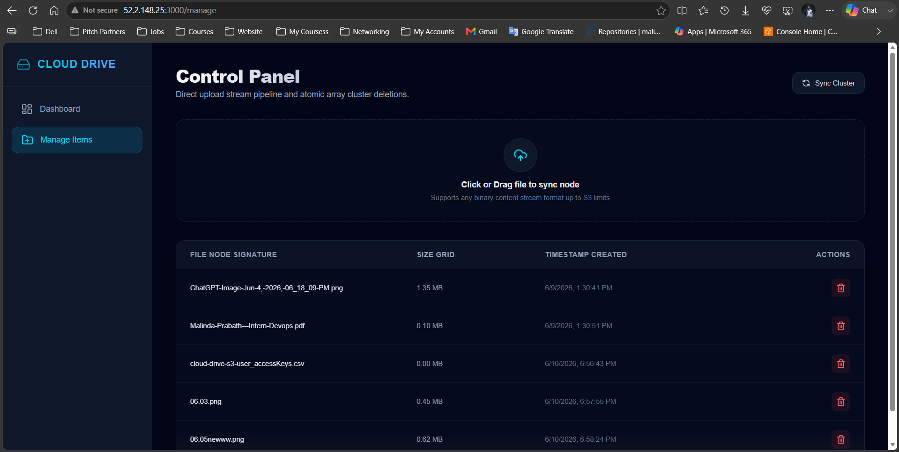

---

## 🏗️ AWS Infrastructure Management

Cloud Driver provides comprehensive AWS resource management and monitoring:

### EC2 Instance Management
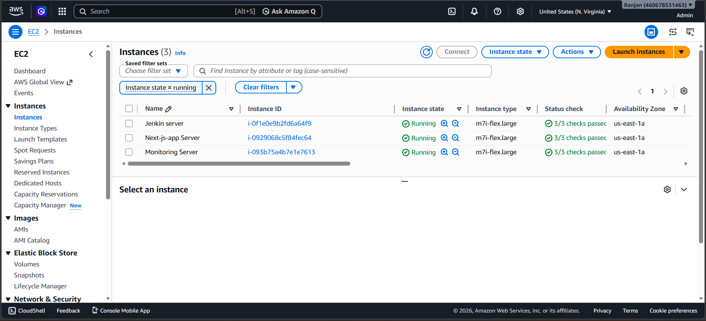

### VPC & Network Configuration
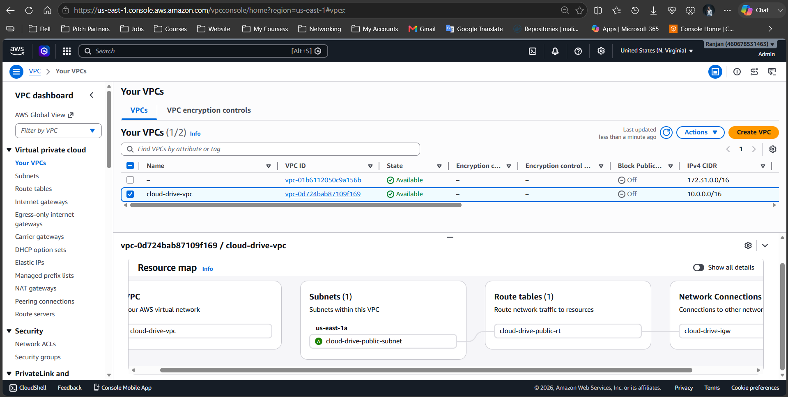
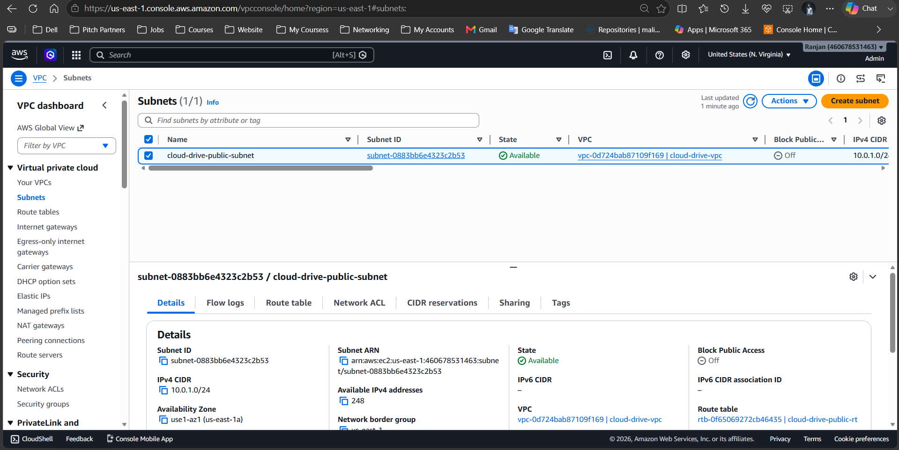
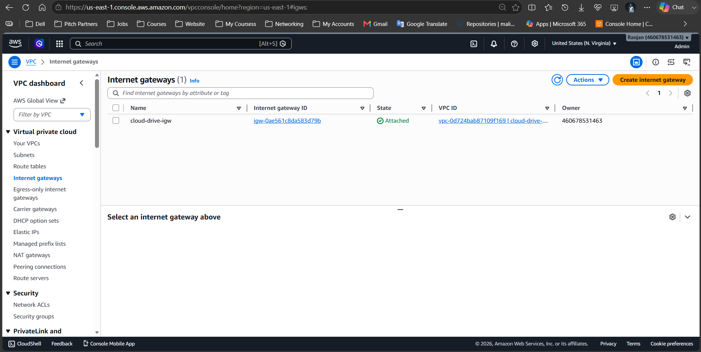
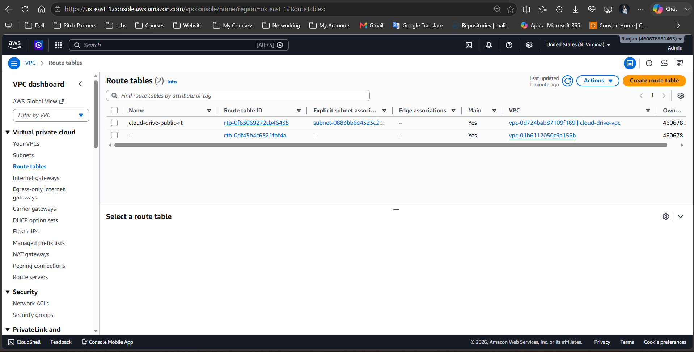

### Security Configuration
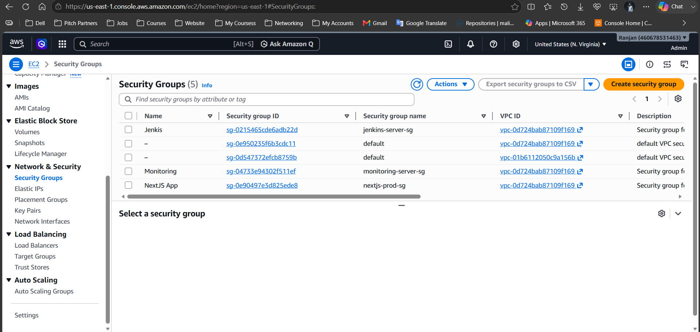
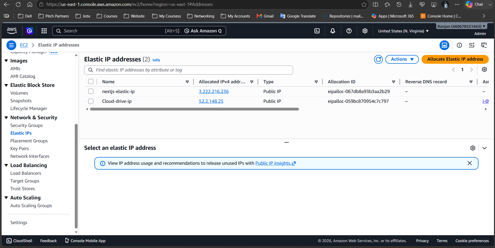

### Storage Management
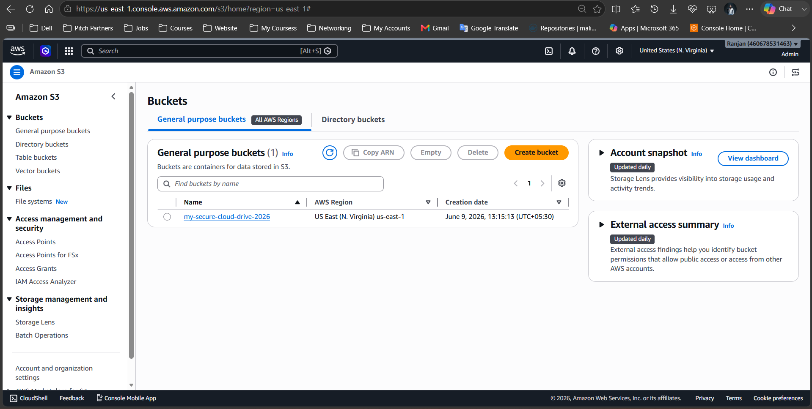
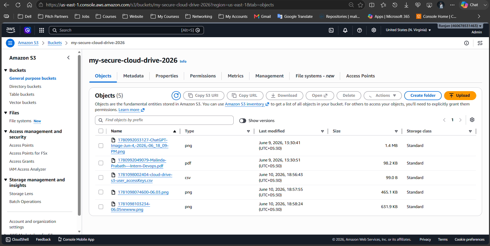

### IAM & Access Control
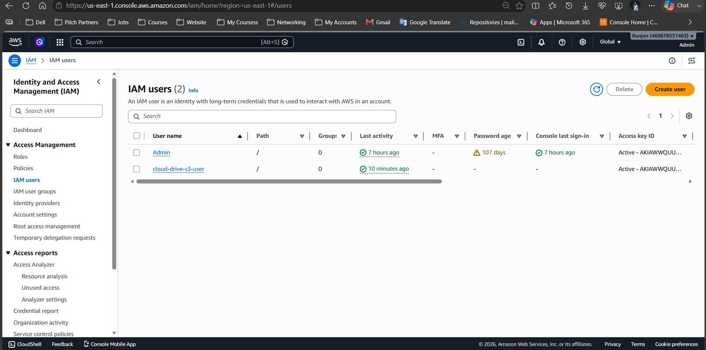

---

## 📈 Monitoring & Analytics

### Grafana Dashboards

Monitor your cloud infrastructure with real-time metrics and performance indicators:

#### Next.js Server Monitoring
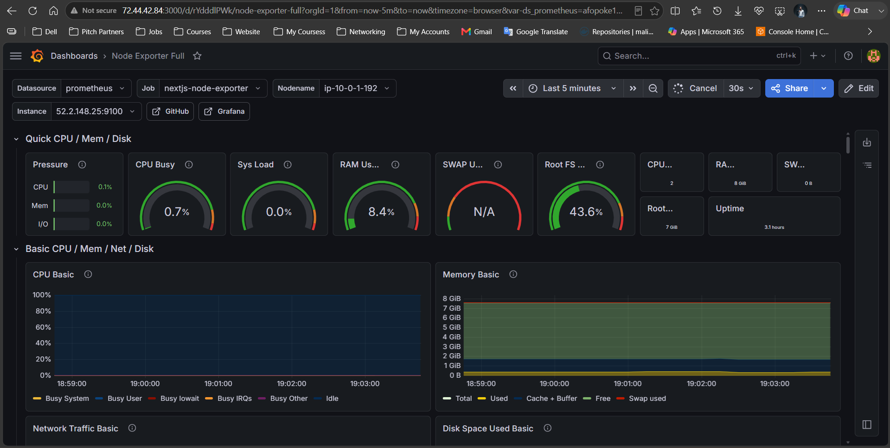

#### Jenkins Server Monitoring
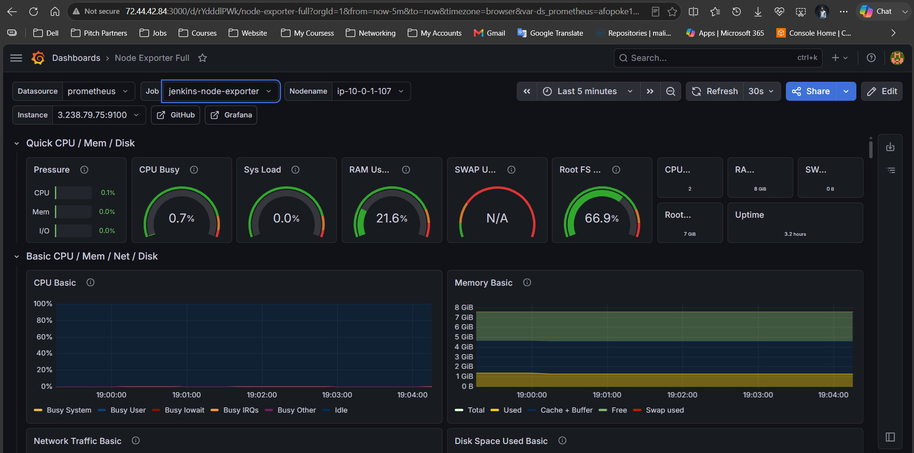

---

## 🔄 CI/CD Pipeline

Cloud Driver integrates with Jenkins for automated deployment and continuous integration:

### Jenkins Pipeline Dashboard
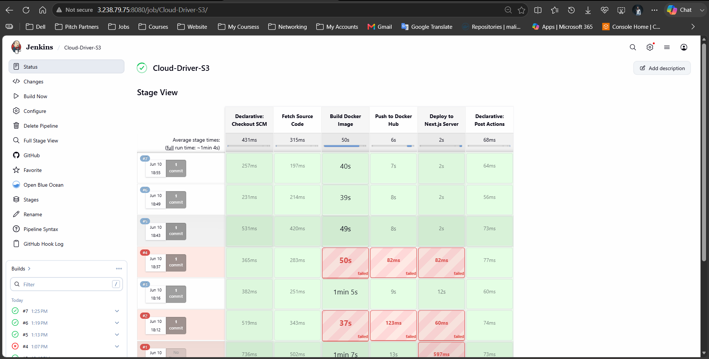

### Pipeline Execution Logs
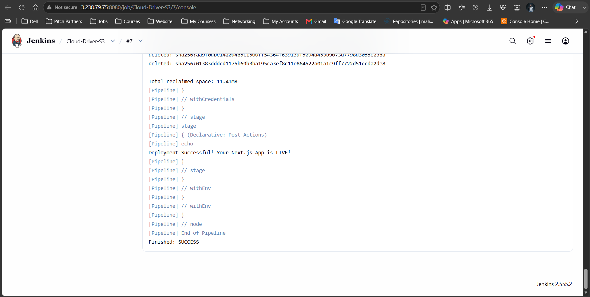

---

## 🛠️ Tech Stack

| Layer | Technology |
|-------|-----------|
| **Framework** | Next.js 16.2.7 |
| **UI Library** | React 19.2.4 |
| **Language** | TypeScript 5 |
| **Styling** | Tailwind CSS 4 |
| **Icons** | Lucide React 1.17.0 |
| **AWS SDK** | @aws-sdk/client-s3 3.1064.0 |
| **Code Quality** | ESLint 9 |
| **Build Tool** | Webpack (via Next.js) |

---

## 🔑 Core Features Explained

### 1. File Storage Management
- Upload files to AWS S3 buckets
- List and retrieve all stored files
- Delete files with confirmation
- Automatic file naming with timestamps
- Support for multiple file types

### 2. Infrastructure Monitoring
- Real-time EC2 instance tracking
- VPC and network visualization
- Security group management
- IAM user and access control
- Elastic IP address management

### 3. Performance Tracking
- Grafana integration for metrics visualization
- Jenkins pipeline monitoring
- System health indicators
- Real-time log streaming

### 4. User Interface
- Responsive design for all devices
- Intuitive sidebar navigation
- Dashboard with at-a-glance metrics
- Management console for advanced operations

---

## 🔐 Security Best Practices

1. **Environment Variables**: Store all AWS credentials in `.env.local` (never commit)
2. **IAM Policies**: Use least privilege principle for AWS permissions
3. **CORS Configuration**: Configure appropriate CORS headers for S3 access
4. **API Authentication**: Implement authentication middleware as needed
5. **HTTPS**: Always use HTTPS in production
6. **Security Groups**: Configure network access with minimal required ports

---

## 📝 Scripts

| Command | Description |
|---------|-----------|
| `npm run dev` | Start development server |
| `npm run build` | Build for production |
| `npm start` | Start production server |
| `npm run lint` | Run ESLint code quality checks |

---

## 🐳 Docker Support

Cloud Driver includes a Dockerfile for containerized deployment:

```bash
docker build -t cloud-driver:latest .
docker run -p 3000:3000 \
  -e AWS_REGION=us-east-1 \
  -e AWS_ACCESS_KEY_ID=your_key \
  -e AWS_SECRET_ACCESS_KEY=your_secret \
  -e AWS_S3_BUCKET_NAME=your_bucket \
  cloud-driver:latest
```

---

## 🚀 Deployment

### Vercel Deployment

Cloud Driver is optimized for Vercel deployment:

```bash
npm i -g vercel
vercel
```

### Traditional Server Deployment

```bash
npm run build
npm start
```

---

## 📧 Support & Documentation

For issues, questions, or feature requests:

- Create an issue in the repository
- Check existing documentation in `readmefiles/`
- Review AWS SDK documentation
- Consult Next.js official documentation

---

## 📄 License

This project is licensed under the MIT License. See LICENSE file for details.

---

## 🙏 Acknowledgments

- Built with **Next.js** - The React framework for production
- Powered by **AWS** - Amazon Web Services
- UI Components from **Lucide React** - Beautiful SVG icons
- Styled with **Tailwind CSS** - Utility-first CSS framework
- Monitored with **Grafana** & **Jenkins**

---

**Cloud Driver** - Manage Your Cloud Infrastructure with Ease ☁️
